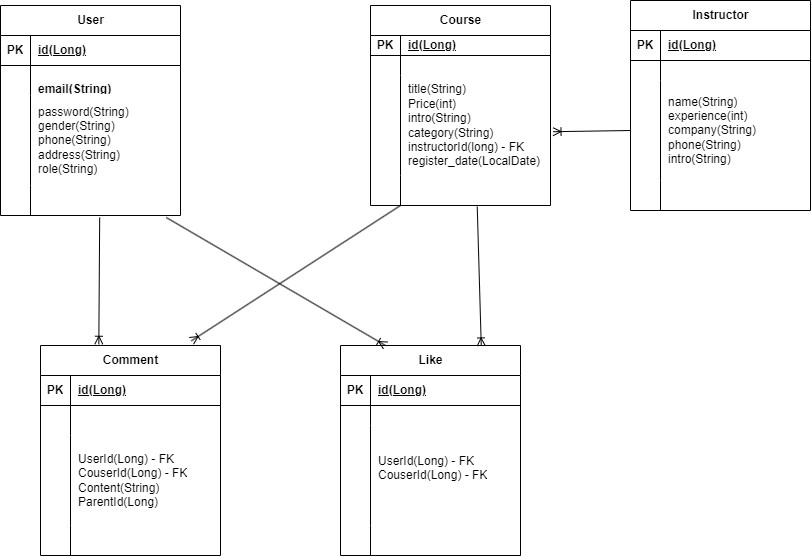
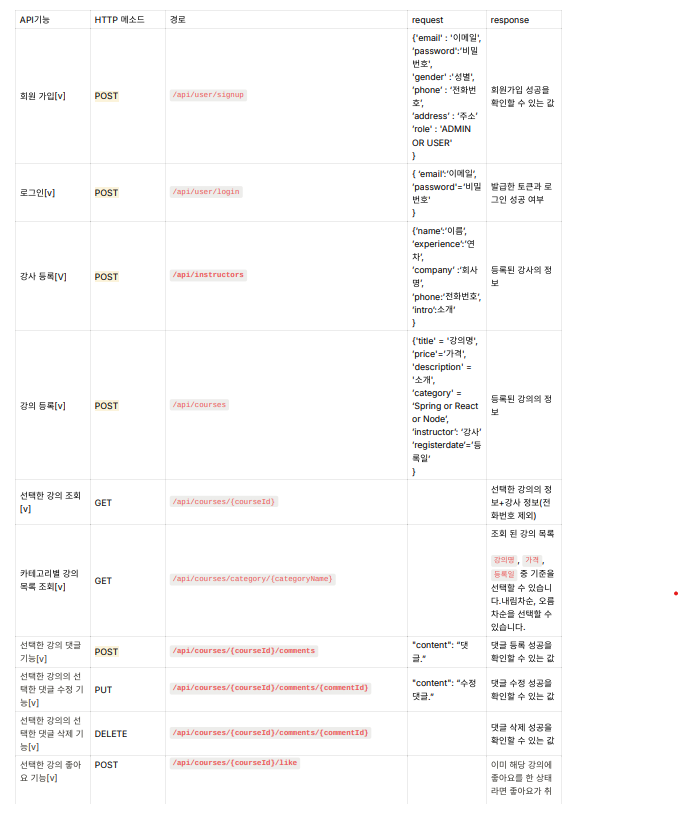
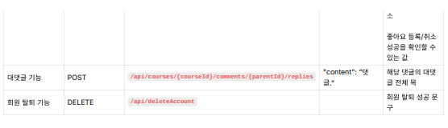

# 📋 스파르타 강의 서버

---------------------------------------------------------------------------------------------
## 💻 프로젝트 개요
- CRUD 
- Spring Security와 JWT를 이용한 인증과 인가
- 권한 별 접근 제어
- JPA를 이용한 연관관계 매핑
---------------------------------------------------------------------------------------------
## 🎯 구현 목록
- [x]  회원 가입 기능
    - `이메일`, `비밀번호`, `성별`, `전화번호`, `주소`, `권한`을 저장할 수 있습니다.
        - ADMIN, USER `권한`이 있습니다.
        - `이메일`은  `올바른 이메일 형식`을 지켜야 합니다.
        - `비밀번호`는  `최소 8자 이상, 15자 이하이며 알파벳 대소문자(a~z, A~Z), 숫자(0~9), 특수문자`로 구성되어야 합니다.
    - 회원가입 성공을 확인할 수 있는 값을 반환합니다.
        - ex) HTTP Status Code, Error Message …
    - 참고자료

      [RegExr: Learn, Build, & Test RegEx](https://regexr.com/3e48o)

      [정규 표현식](https://ko.wikipedia.org/wiki/정규_표현식)

      [[Spring] @Valid와 @Validated를 이용한 유효성 검증의 동작 원리 및 사용법 예시 - (1/2)](https://mangkyu.tistory.com/174)

      [[Spring Boot] @Valid 어노테이션으로 Parameter 검증하기](https://bamdule.tistory.com/35)

- [x]  로그인 기능
    - 회원은 `이메일`, `비밀번호`를 입력하여 서버에 로그인을 요청할 수 있습니다.
    - 로그인 성공 시, `회원의 정보`와 `JWT`를 활용하여 토큰을 발급하고,
      발급한 토큰을 Header에 추가한 후 로그인 성공을 확인할 수 있는 값과 함께 반환합니다.
        - ex) HTTP Status Code, Error Message …
- [x]  강사 등록 기능
    - `이름`, `경력(년차)`, `회사`, `전화번호`, `소개`를 저장할 수 있습니다.
        - 로그인을 통해 발급받은 JWT가 함께 요청됩니다.
        - ADMIN 권한을 가진 회원만 강사 등록이 가능합니다.
    - 등록된 강사의 정보를 반환 받아 확인할 수 있습니다.
- [x]  강의 등록 기능
    - `강의명`, `가격`, `소개`, `카테고리`, `강사`, `등록일`을 저장할 수 있습니다.
        - Spring, React, Node `카테고리`가 있습니다.
        - 강사 한 명이 여러 개의 강의를 촬영할 수도 있습니다.
        - 로그인을 통해 발급받은 JWT가 함께 요청됩니다.
        - ADMIN 권한을 가진 회원만 강의 등록이 가능합니다.
    - 등록된 강의의 정보를 반환 받아 확인할 수 있습니다.
- [x]  선택한 강의 조회 기능
    - 선택한 강의의 정보를 조회할 수 있습니다.
        - 모든 사용자가 강의를 조회할 수 있습니다.
        - 강의를 촬영한 강사의 정보를 확인할 수 있습니다.
            - 강사의 정보에 `전화번호`는 제외 되어있습니다.
- [x]  카테고리별 강의 목록 조회 기능
    - 선택한 `카테고리`에 포함된 강의를 조회할 수 있습니다.
        - 모든 사용자가 강의를 조회할 수 있습니다.
        - 강사의 정보는 제외됩니다.
    - 조회된 강의 목록은 선택한 기준에 의해 정렬됩니다.
        - `강의명`, `가격`, `등록일` 중 기준을 선택할 수 있습니다.
        - 내림차순, 오름차순을 선택할 수 있습니다.
- [x]  선택한 강의 댓글 기능
    - 선택한 강의에 댓글을 등록할 수 있습니다.
        - 로그인을 통해 발급받은 JWT가 함께 요청됩니다.
        - 회원만 댓글 등록이 가능합니다.
    - 댓글 등록 성공을 확인할 수 있는 값을 반환합니다.
        - ex) HTTP Status Code, Error Message …
    - 선택한 강의를 조회할 때 해당 강의에 등록된 댓글들도 함께 조회할 수 있습니다.
- [x]  선택한 강의의 선택한 댓글 수정 기능
    - 선택한 강의의 선택한 댓글을 수정할 수 있습니다.
        - 로그인을 통해 발급받은 JWT가 함께 요청됩니다.
        - 해당 댓글을 등록한 회원만 댓글 수정이 가능합니다.
    - 댓글 수정 성공을 확인할 수 있는 값을 반환합니다.
        - ex) HTTP Status Code, Error Message …
- [x]  선택한 강의의 선택한 댓글 삭제 기능
    - 선택한 강의의 선택한 댓글을 삭제할 수 있습니다.
        - 로그인을 통해 발급받은 JWT가 함께 요청됩니다.
        - 해당 댓글을 등록한 회원만 댓글 삭제가 가능합니다.
    - 댓글 삭제 성공을 확인할 수 있는 값을 반환합니다.
        - ex) HTTP Status Code, Error Message …
- [x]  선택한 강의 좋아요 기능
    - 선택한 강의에 좋아요를 등록할 수 있습니다.
        - 로그인을 통해 발급받은 JWT가 함께 요청됩니다.
        - 회원만 좋아요 등록이 가능합니다.
        - 이미 해당 강의에 좋아요를 한 상태라면 좋아요가 취소됩니다.
    - 좋아요 등록/취소 성공을 확인할 수 있는 값을 반환합니다.
        - ex) HTTP Status Code, Error Message …
    - 선택한 강의를 조회할 때 해당 강의의 좋아요 수를 함께 조회할 수 있습니다.
- [x]  공통 기능
    - 로그인 요청의 비밀번호 불일치 등 API 요청의 예외가 발생하는 모든 경우에 대해서 실패(예외상황)에 대해 판단할 수 있는 Status Code, Error 메시지등의 정보를 반환합니다.

---------------------------------------------------------------------------------------------
## 🔥 **추가 구현 기능**
- [x]  대댓글 기능
   - 대댓글이 가능하도록 구현해보세요!
- [x]  회원 탈퇴 기능
   - 회원 탈퇴 시 회원과 연관된 데이터가 모두 삭제될 수 있도록 구현해보세요!
- [x]  Spring Security를 적용하여 인증/인가를 구현합니다.
   - Security의 Secured 기능을 사용하여 권한별로 API를 제어할 수 있습니다.

---------------------------------------------------------------------------------------------
## 🛠️ 기술 스택
- Spring Boot
- JWT
- Spring Security
- JPA/Hibernate
- MySQL

---------------------------------------------------------------------------------------------
## 📁 ERD

---------------------------------------------------------------------------------------------
## 📃 API 명세서

https://documenter.getpostman.com/view/28626611/2sA2xiXCi1

---------------------------------------------------------------------------------------------
## 개발자

- 신수현 a01065849764@gmail.com